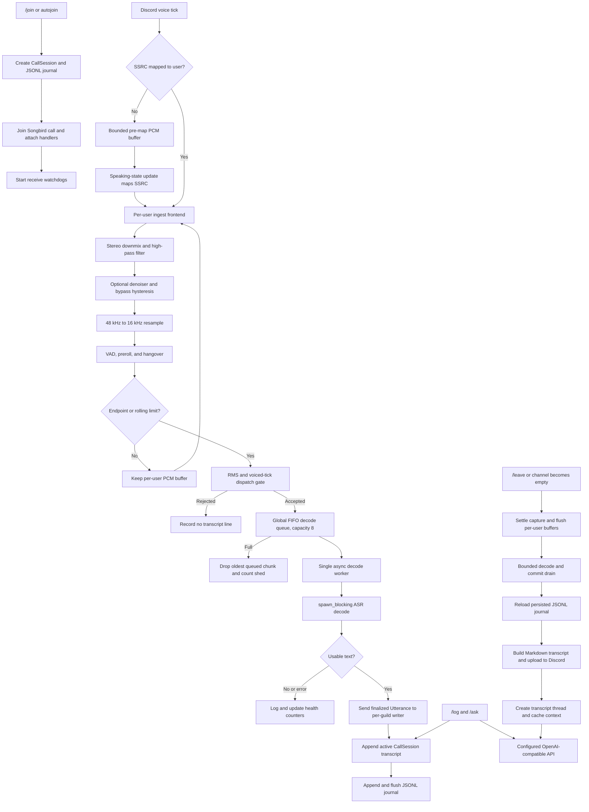

# Architecture

This document describes the implemented runtime, its durability boundaries, and the code that owns each stage. For installation and commands, see the [README](README.md) and [usage guide](USAGE.md).

## System Boundaries

- One active call session per guild.
- Speech recognition runs locally through one configured sherpa-onnx model.
- The transcript is utterance-final: no partial text or later revisions are emitted.
- Finalized utterances are journaled incrementally to disk before export.
- An OpenAI-compatible API is used only for optional Q&A and summaries, not speech recognition.

## Detailed Runtime Flow

The queue is global across guilds, bounded to eight chunks, and intentionally sheds the oldest queued item when full. This caps memory and latency growth at the cost of missing audio under sustained overload.

## Audio And Transcription

- Per-user ingest frontend combines DSP/VAD state + rolling buffer.
- Pipeline stages: downmix, high-pass, optional denoise, 48k->16k resample, VAD, endpointing.
- Rolling ingest bounds long speech segments and dispatches chunks through a bounded decode queue.
- Rollover chooses a split near the context boundary using a min-RMS search window to avoid cutting through louder speech.
- Dispatch gating rejects chunks without enough voiced activity or above the implausible text-rate threshold.

## Transcript Durability And Ordering

- Transcript commits are append-only and persisted incrementally to JSONL.
- The writer maintains the active in-memory transcript, then flushes each JSONL record.
- Export reloads the persisted JSONL journal rather than trusting only in-memory state.
- Finalization settles capture, flushes buffered speech, and waits for decode and commits with bounded timeouts.
- A timeout can produce a partial export; it is preferred over a permanently blocked shutdown.

## State Ownership

- `CallSession`: active transcript, Discord channel IDs, timestamps, and JSONL path.
- `GuildRuntime`: utterance sender, health counters, recovery coordination, and decode state.
- `UserStreamState`: per-user DSP/VAD state and rolling PCM buffer.
- `SsrcMap`: guild and SSRC to Discord-user mapping.
- `ThreadContext`: cached exported transcript and bounded Q&A turn history.

## Failure Handling And Observability

- Startup and steady-state watchdogs attempt to recover a voice receive path that joins successfully but produces no usable audio.
- Unknown SSRC PCM is retained briefly and within a fixed bound until a speaking-state mapping arrives.
- Resample failures, ASR errors, journal failures, queue shedding, and unmapped SSRC activity are logged and reflected in `/status` counters.
- A poisoned decode-queue mutex is recovered rather than crashing the worker.
- Journal write failures are logged; later queued records continue to be processed, but the failed utterance is not durable.

## Configuration Model

Secrets and file selection are environment-driven:

- `DISCORD_TOKEN` is required.
- `OPENAI_API_KEY` is the default optional bearer-token variable. `[ai].api_key_env` can select another variable; local servers such as Ollama do not normally need a key.
- `APP_CONFIG_PATH` optionally selects a TOML file; it defaults to `config.toml`.

All other runtime settings live in `config.toml`: AI provider/model and timeout, ASR model directory and threads, denoiser, endpointing and rolling-buffer limits, journal retention, autojoin suffix, debug logging, and summary behavior. See [config.example.toml](config.example.toml) for defaults.

Before normal startup, the CLI handles `init`, `doctor`, and help requests. `init` creates missing default templates without overwriting existing files; a normal launch with no default `config.toml` runs the same initialization and exits. `doctor` validates the resolved configuration and ASR model, then queries the AI API's model list without sending a generation request.

## Module Map

- `src/main.rs`: process startup, Discord intents, and event routing.
- `src/cli.rs`: startup command parsing, template initialization, and local preflight checks.
- `src/config.rs`: `.env`, TOML, and runtime configuration resolution.
- `src/ai.rs`: OpenAI-compatible Chat Completions client and transcript prompt construction.
- `src/asr/audio.rs`: Songbird voice receive, SSRC handling, segmentation, and decode dispatch.
- `src/asr/frontend.rs`: downmix, high-pass, denoise bypass, resampling, VAD, and preroll.
- `src/asr/pipeline.rs`: recognizer setup, dispatch gate, tail trim, and stream-state types.
- `src/asr/models.rs`: model-layout detection and sherpa-onnx recognizer wiring.
- `src/asr/decoder.rs`: global bounded decode queue and worker.
- `src/app/`: command handling, sessions, watchdogs, journal, autojoin, export, and thread context.

## Intentional Limits

- No partial or revised captions are shown during speech.
- The decode dispatcher has one worker and a global bounded queue; overload sheds chunks rather than growing without bound.
- Thread Q&A history is in memory and intentionally bounded.
- Active runtime state is not restored after a process restart; persisted transcripts remain available for export and thread-context reload.
